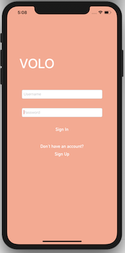
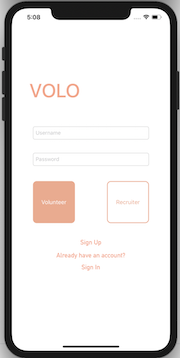
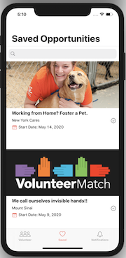
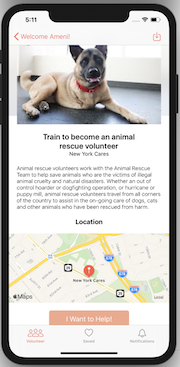
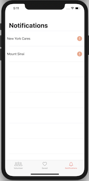
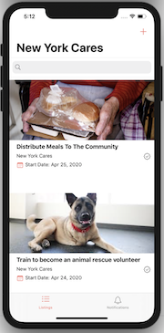
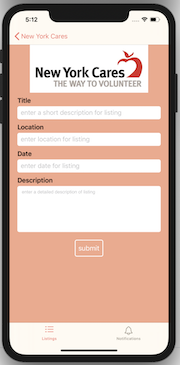
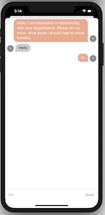

# VOLO - Hackathon App (Community Health)

## Contributors
[Ameni Alsaydi](https://github.com/AmeniAlsaydi) 

[Eric Davenport](https://github.com/EricDavenport) 

[Brendon Cecilio](https://github.com/bcecilio)

[Kelby Mittan](https://github.com/kelby-mittan)


## Description

Volo is an application that is designed to make searching for and finding volunteering opportunities, as well as out reaching out to interested parties more pleasurable and personable. It allopws for a user to sign up as either a volunteer or a recruiter for an organization. Depending on what
they sign up as, the user will either be presented with a specific user experience for a volunteer searching for volunteer 
opportunities or an experience for an organization's recruiter. Volo is distinct in that it prompts in-app messaging between 
a volunteer and recruiter for a volunteer organization. Once a volunteer has searched for an opportunity and showed their interest 
in the opportunity, the recruiter who made the posting for the opportunity will be notified and a chat can be initiated by either side.

## Frameworks
- Firebase
- MapKit
- MessageKit
- Kingfisher

## ScreenShot of App










##  Volunteer


## Recruiter


## Code Snippets

### Loading a Chat
```swift
public func loadChats(user1ID: String, user2ID: String, completion: @escaping (Result<Chat, Error>) -> ()) {
    db.collection(DatabaseService.chats).whereField(DatabaseService.users, arrayContains: user1ID).getDocuments { (snapshot, error) in
      if let error = error {
        completion(.failure(error))
      } else if let snapshot = snapshot {
        for doc in snapshot.documents {
          if let chat = Chat(dictionary: doc.data()) {
          if (chat.users.contains(user2ID)) {
            self.docRef = doc.reference
            let docReference = doc.reference
            docReference.collection(DatabaseService.threads).order(by: "created", descending: false)
          }
          completion(.success(chat))
          }
        }
      }
    }
  }
```
